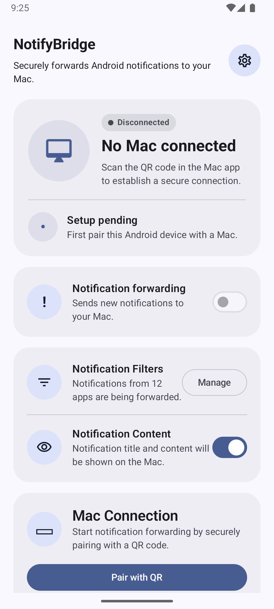
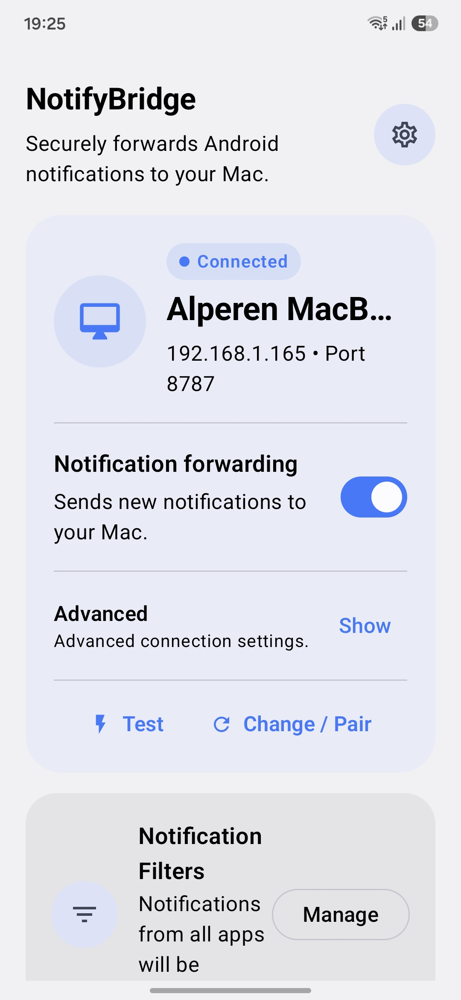
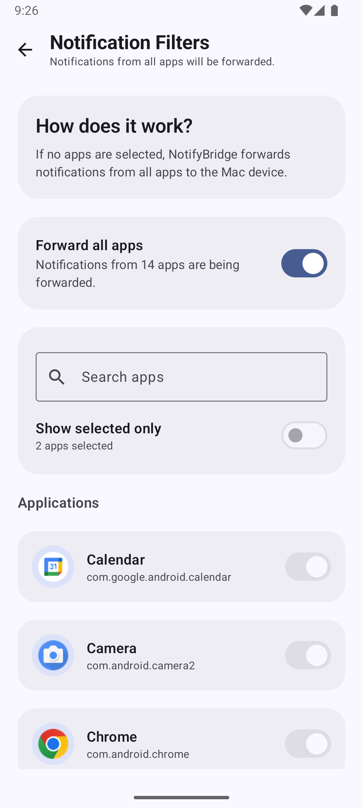
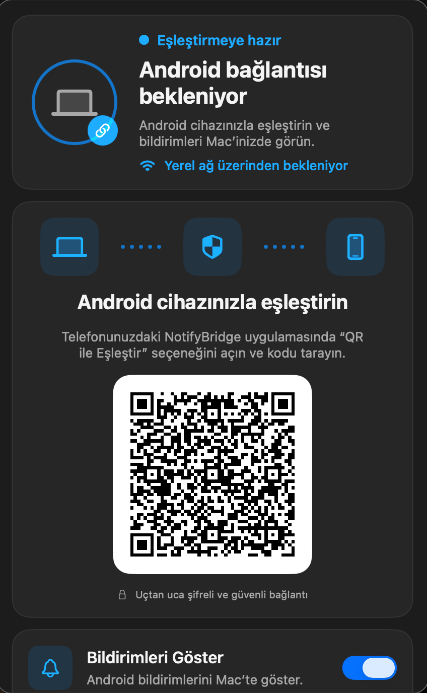
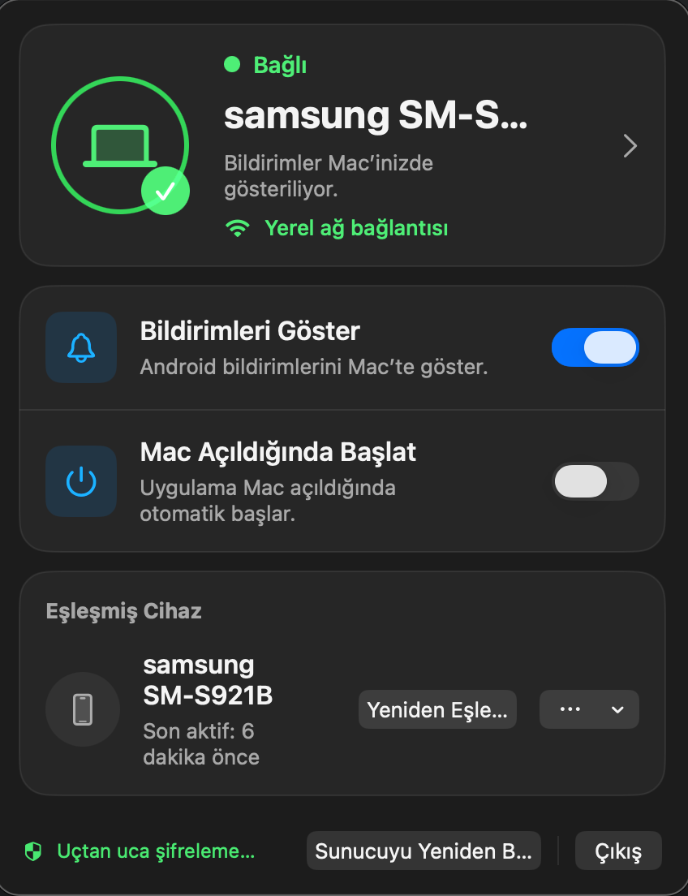
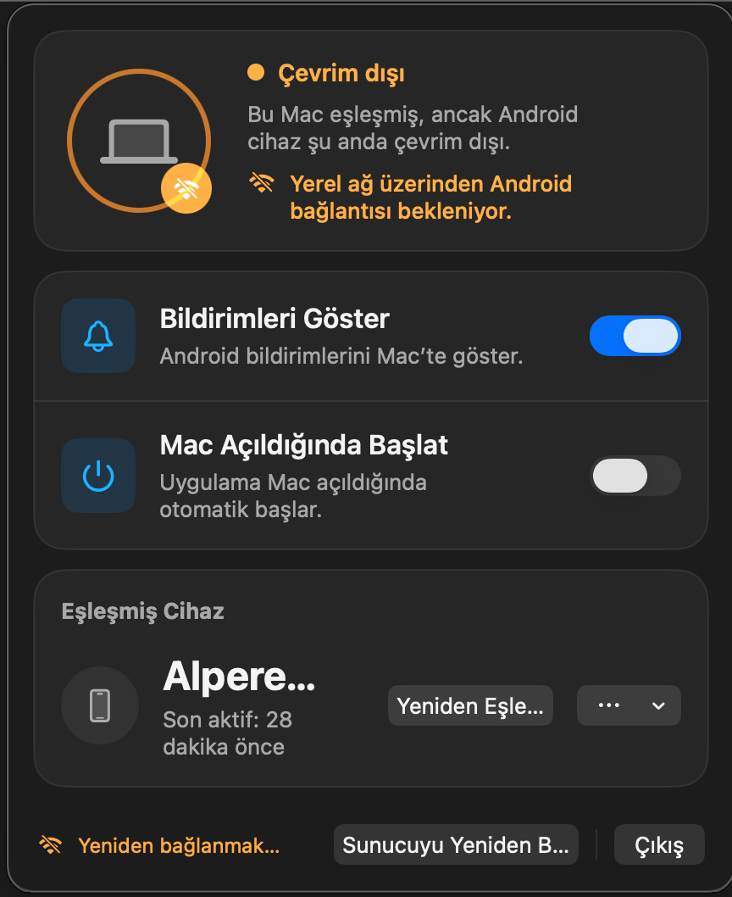

# NotifyBridge

<p align="center">
  
</p>

<p align="center">
  <strong>Securely forward Android notifications to your Mac.</strong>
  <br>
  Privacy-first • Local-first • Open Source
</p>

---

## Overview

NotifyBridge allows you to receive and interact with Android notifications directly from your Mac.

Unlike cloud-based notification syncing solutions, NotifyBridge keeps all communication inside your local network. Your notification data never passes through third-party servers.

Built with a security-first architecture, NotifyBridge uses encrypted communication, certificate pinning, local pairing, and native applications on both Android and macOS.

## Key Features

### Notification Forwarding
- Receive Android notifications instantly on macOS.
- Native macOS notification integration.
- Application icon support.
- Real-time delivery over local network.

### Notification Actions
- Dismiss notifications from Mac.
- Open the related app on Android.
- Reply directly from macOS notifications when supported.

### Security & Privacy
- Local network only.
- No cloud infrastructure.
- No analytics.
- No tracking.
- AES-256-GCM encrypted payloads.
- HMAC-SHA256 request signing.
- TLS certificate pinning.
- Secure QR-based pairing.

### Reliability
- Android foreground service.
- Notification Listener Service integration.
- Automatic reconnection.
- Launch at Login support on macOS.
- Connection health monitoring.

---

## Screenshots

### Android

| Home | Connected Android |
|--------|--------|
|  |  |

| Notification Filter |
|--------|
|  |

### macOS

| Pairing | Connected |
|----------|----------|
|  |  |

| Offline State |
|--------------|
|  |

---

## Architecture

```text
Android Device
       │
       │ AES-256-GCM + TLS
       ▼
macOS Local Server
       │
       ▼
Native macOS Notifications
```

Communication never leaves the local network.

---

## Technology Stack

### Android
- Kotlin
- Jetpack Compose
- Material 3
- Notification Listener Service
- Foreground Service
- QR Code Scanning
- TLS Certificate Pinning

### macOS
- SwiftUI
- UserNotifications
- Network Framework
- Bonjour Discovery
- Local TLS Server

---

## Installation

### Android

1. Download the latest Android APK from Releases.
2. Install the application.
3. Grant required permissions.
4. Open NotifyBridge.

### macOS

1. Download the latest macOS release.
2. Move NotifyBridge to Applications.
3. Launch the application.
4. Allow notification permissions.

---

## Pairing

1. Open NotifyBridge on macOS.
2. Display the pairing QR code.
3. Open NotifyBridge on Android.
4. Tap "Pair with QR".
5. Scan the QR code.
6. Grant required permissions.
7. Enable notification forwarding.

After pairing, notifications will start appearing on your Mac.

---

## Supported Actions

| Action | Support |
|----------|----------|
| Receive notifications | Yes |
| Dismiss notification | Yes |
| Open app on Android | Yes |
| Direct reply | Yes |
| QR pairing | Yes |
| Local encryption | Yes |
| Cloud dependency | No |

---

## Security Model

NotifyBridge was designed with privacy as a primary requirement.

Security protections include:

- AES-256-GCM payload encryption.
- HMAC-SHA256 request validation.
- TLS certificate pinning.
- Pairing token authentication.
- Replay attack protection.
- Local-only communication.

For more details see:

- docs/SECURITY.md
- docs/PAIRING.md
- docs/TROUBLESHOOTING.md

---

## Project Structure

```text
NotifyBridge/
├── android/
│   └── NotifyBridge/
├── macos/
│   └── NotifyBridgeMac/
├── docs/
│   ├── PAIRING.md
│   ├── SECURITY.md
│   └── TROUBLESHOOTING.md
├── assets/
│   ├── logo.png
│   └── screenshots/
├── README.md
├── LICENSE
└── .gitignore
```

---

## Roadmap

### Planned
- Multiple device support.
- Rich notification previews.
- File sharing.
- Clipboard synchronization.
- Notification history.
- Improved notification grouping.

---

## Contributing

Contributions, bug reports, feature requests, and pull requests are welcome.

If you discover a security issue, please report it privately before creating a public issue.

---

## License

Distributed under the MIT License.

See LICENSE for more information.

---

## Author

Mahmut Alperen Ünal - AlpWare Studio

Website:
https://mahmutalperenunal.com

AlpWare Studio:
https://alpwarestudio.com

---

<p align="center">
Made with Kotlin, SwiftUI and a strong focus on privacy.
</p>